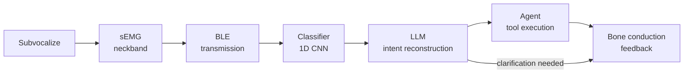

# Signal-path diagram

**Status:** stub — fill in during architecture task 5  
**Depends on:** 02-electrode-layout.md, 04-intent-reconstruction.md, bench experiment design (task 6)  
**Feeds into:** 06-architecture-piece.md §5, systems engineering doc (task 16), the corpus anatomical illustration (brand/design task 8)

---

## The 7-stage signal path

```
subvocalize → sEMG → BLE → classifier → LLM → agent → bone conduction
```

Each stage is detailed below. This is the source of truth for the latency budget (task 16) and the system block diagram illustration (brand/design task 8).

---

## Stage 1: Subvocalize

**What happens:** The user internally articulates a command. Motor cortex sends efferent signals to speech-muscle neuromuscular junctions. MUAPs propagate along muscle fibers, generating a spatiotemporal electrical field that permeates through tissue to the skin surface.

**Key parameters to fill in:**
- Onset-to-surface latency: sEMG precedes acoustic speech by approximately 60 ms (cite source from synthesis)
- Signal frequency band: 20–450 Hz (subvocal); confirm whether subvocal signal has a narrower band than vocalized
- Signal amplitude: 10–500 µV at the skin surface (confirm from literature)
- What differentiates subvocally mouthed from purely covert internal speech at this stage (fill in from SilentWear / NASA discussion)

---

## Stage 2: sEMG acquisition

**What happens:** Electrodes on the neckband capture differential voltage between contacts within each bipolar pair. Signals are amplified, bandpass filtered (20–450 Hz), and digitized.

**Key parameters to fill in:**
- Electrode type: dry (proposed), gel (lab baseline)
- Instrumentation amp gain: fill in from ADS1115 + INA128 spec (task 6)
- Sampling rate: fill in (target ≥1000 Hz, check Nyquist for 450 Hz cutoff; SilentWear used 2048 Hz for HD mapping, runtime systems can use lower)
- ADC resolution: 16-bit (ADS1115 is 16-bit differential)
- On-device filtering: bandpass + notch at 60 Hz (fill in from bench experiment design)
- Number of active channels: 10–14 (fill in from electrode layout decision)
- On-device buffer size and overflow behavior (fill in from firmware spec, task 12)

**Latency at this stage:** one sampling window = fill in (e.g., 100 ms window at 10 ms stride = 90 ms latency added)

---

## Stage 3: BLE transmission

**What happens:** The on-device microcontroller (ESP32 or equivalent) packetizes the digitized sEMG data and transmits via Bluetooth Low Energy to the paired smartphone or edge device.

**Key parameters to fill in:**
- BLE GATT service design: characteristic schema, notification interval (fill in from firmware spec, task 12)
- Transmission rate: number of bytes per packet × packet rate
- BLE latency: connection interval typical range is 7.5–300 ms; for real-time sEMG, target ≤15 ms connection interval
- MTU size and packet fragmentation (fill in)
- Battery impact of BLE transmission at target update rate (fill in from power budget, task 16)

**Latency at this stage:** BLE connection interval + transmission overhead = fill in (target <20 ms)

**Alternative:** on-device inference (SilentWear does this with BioGAP-Ultra at 20.5 mW). Note the architectural branch point: transmit raw data to phone for classification, OR classify on-device and transmit only the token. The current architecture chooses to transmit raw data for Phase 0/1, because the classifier is still being trained and updated frequently. On-device inference is a later-phase optimization.

---

## Stage 4: Classifier

**What happens:** A machine learning model receives a window of multichannel sEMG samples and outputs a class label (command token) or a probability distribution over classes.

**Key parameters to fill in:**
- Input: N_channels × N_timesteps tensor (fill in from bench experiment spec)
- Model architecture: 1D CNN (proposed for Phase 1); comparison with GRU and feature-based SVM in task 7 benchmarking
- Output: softmax probability over vocabulary classes (not hard argmax — pass top-K with confidence to the LLM)
- Inference latency: fill in from ML pipeline benchmarking (task 8); target <50 ms on-phone
- Cross-session accuracy: 59.3% (SilentWear baseline without calibration) → target ≥85% with per-session fine-tune
- Calibration data requirement: target <10 minutes (SilentWear achieved +10% recovery with <10 min fine-tune)

**Failure mode:** classifier outputs low-confidence result or wrong token → propagates to LLM with confidence score; LLM triggers clarification. Do NOT hard-fail here.

**Latency at this stage:** inference time = fill in (target <50 ms)

---

## Stage 5: LLM intent reconstruction

**What happens:** The LLM receives the classifier's output (noisy token + confidence), the current task context, and conversation history. It produces a structured intent object.

**Key parameters to fill in:**
- Model: Claude Haiku (target for production, lowest latency among capable models); GPT-4o-mini as alternative; local Llama 3 8B for on-device future
- Input format: fill in from Phase 0 prompt architecture (task 5)
- Output schema: `{ command: string, params: object, confidence: float, clarification_needed: bool, clarification_text: string | null }`
- Latency: Haiku API p50 latency = fill in from Phase 0 measurement; target <300 ms
- Context window management: how many turns of history to include before truncation
- Fallback: if LLM confidence below threshold → surface clarification via bone conduction (stage 7)

**Latency at this stage:** LLM round-trip = fill in (target <300 ms)

---

## Stage 6: Agent / tool execution

**What happens:** The structured intent from the LLM is dispatched to the appropriate tool or system action.

**Key parameters to fill in:**
- Tool registry: list of available actions in the warehouse context (confirm pick, request help, query inventory, log exception, navigate, communicate with coordinator)
- Execution pattern: synchronous (wait for tool result before responding) or fire-and-forget
- Error handling: what if the tool call fails (e.g., WMS API is down)?
- Authentication: how does the agent authenticate to backend systems (fill in from data/security architecture, task 13)

**Latency at this stage:** tool execution = fill in (WMS API call: typically 50–200 ms)

---

## Stage 7: Bone conduction audio feedback

**What happens:** The system's response (confirmation, clarification question, or error) is synthesized to audio and played back via bone conduction transducers in the neckband or a paired bone conduction earpiece.

**Key parameters to fill in:**
- TTS model: fill in (device system TTS for low latency, or neural TTS for naturalness)
- Bone conduction hardware: integrated into neckband vs. separate earpiece (decision for CAD task 9)
- Audio latency: fill in (TTS synthesis + playback buffer)
- Why bone conduction: leaves ear canal open for ambient awareness; compatible with hearing protection in industrial environments; AlterEgo used this and it is the correct approach for the warehouse wedge

**Latency at this stage:** TTS synthesis + bone conduction playback = fill in (target <200 ms)

---

## End-to-end latency budget (placeholder)

| Stage | Target latency |
|-------|---------------|
| Subvocalize → sEMG surface | ~60 ms (physiological, fixed) |
| sEMG acquisition (window) | fill in |
| BLE transmission | <20 ms |
| Classifier inference | <50 ms |
| LLM intent reconstruction | <300 ms |
| Agent tool execution | <200 ms |
| TTS + bone conduction | <200 ms |
| **Total (p50 target)** | **fill in — target <1 s** |

*Fill in: compare this budget to Vocollect's total interaction latency (speak → system confirms → pick). Is <1 s competitive?*

---

## Diagram placeholder

When writing the architecture piece, this section will be replaced with a rendered diagram. The diagram should be produced as an SVG or a Mermaid flowchart.



*Note: The final published diagram should show latency annotations on each arrow, and should include the parallel data path (raw sEMG → logging → training pipeline) as a dashed line. The anatomical illustration of the electrode zones (brand/design task 8) is a companion diagram, not this one.*

---

## Open questions

- [ ] Confirm BLE connection interval achievable on ESP32 with nRF52840 (SilentWear uses nRF; what does the proposed BOM use?)
- [ ] Determine target sampling rate for the Phase 1 bench rig
- [ ] Get actual Claude Haiku API latency measurements from Phase 0 benchmarking
- [ ] Decide on-device vs. phone-side classifier architecture for Phase 1
- [ ] Determine bone conduction hardware (integrated into neckband or external; budget impact)
