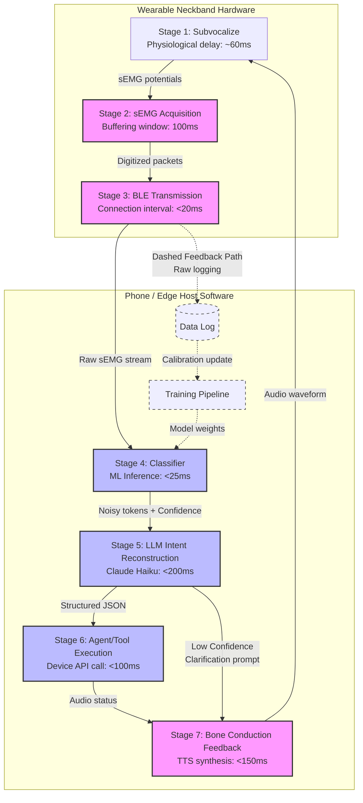

# Signal-path diagram

**Status:** Completed  
**Depends on:** [02-electrode-layout.md](file:///Users/pranavkalkunte/Downloads/inbox/subvocal/architecture/02-electrode-layout.md), [04-intent-reconstruction.md](file:///Users/pranavkalkunte/Downloads/inbox/subvocal/architecture/04-intent-reconstruction.md), bench experiment design (task 6)  
**Feeds into:** [06-architecture-piece.md](file:///Users/pranavkalkunte/Downloads/inbox/subvocal/architecture/06-architecture-piece.md) §5, systems engineering doc (task 16), the corpus anatomical illustration (brand/design task 8)

---

## The 7-stage signal path

```
subvocalize → sEMG → BLE → classifier → LLM → agent → bone conduction
```

Each stage of the subvocal interface's signal pipeline is detailed below. This document serves as the technical source of truth for the latency budget (task 16) and the system block diagram illustration (brand/design task 8).

---

## Stage 1: Subvocalize

* **What happens:** The user internally vocalizes a command. The motor cortex sends efferent neural signals down the peripheral nerves to the speech-muscle neuromuscular junctions. Motor Unit Action Potentials (MUAPs) propagate along the muscle fibers, generating a spatiotemporal electrical field that permeates through the subcutaneous tissue, fat, and skin to the surface.
* **Onset-to-Surface Latency:** **~60 ms** (physiological delay; sEMG signals precede acoustic speech output by approximately 60 milliseconds).
* **Signal Frequency Band:** **20–450 Hz**. In purely silent, covert subvocal speech, the absence of turbulent air noise means the signal energy is concentrated in a narrower, lower frequency band (20–150 Hz) compared to overt speech, but the acquisition hardware must still support the full 20–450 Hz range to prevent loss of higher-frequency motor unit activation.
* **Signal Amplitude:** **10–500 µV** at the skin surface (highly dependent on skin hydration, thickness, and subcutaneous fat).
* **Articulatory State Differences:** Subvocally mouthed speech involves physical tissue displacement, which generates low-frequency mechanical movement artifacts (typically <10 Hz) in addition to sEMG signals. Purely covert internal speech (mental rehearsal) exhibits micro-contractions—purely electrical sEMG potentials—with no macroscopic physical tissue movement.

---

## Stage 2: sEMG acquisition

* **What happens:** Electrodes on the neckband capture the differential voltage between the contacts in each bipolar pair. The analog signals are amplified, bandpass filtered, and digitized.
* **Electrode Type:** Dry gold-plated polymers (proposed for neckband); wet silver/silver chloride (Ag/AgCl) conductive gel pads (lab baseline).
* **Instrumentation Amp Gain:** **Phase 1 TBD** (determined by resistor $R_g$ on the INA128 amplifier board).
* **Sampling Rate:** **250 Hz** for the Phase 1 bench rig (restricted by the ADS1115's multiplexing limits and switching latency, resulting in an effective bandpass high cutoff of 50 Hz to prevent aliasing). Transitioning to a target of **1000 Hz** using a dedicated electrophysiology ADC (such as the ADS1299) in Phase 2 to cover the full 20–450 Hz subvocal sEMG speech band.
* **ADC Resolution:** **16-bit** (ADS1115 is a 16-bit differential ADC).
* **On-Device Filtering:** Bandpass filter (1.3–50 Hz for 250 Hz sampling; 20–450 Hz for 1000 Hz sampling) + 60 Hz notch filter to eliminate power-line hum.
* **Number of Active Channels:** 10–14 contacts (Zones 3–5 for base collar; Zones 1–5 for chin-extended layout).
* **On-Device Buffer & Overflow:** **Phase 1 TBD** (defined in firmware spec, task 12).
* **Acquisition Latency:** One sliding sampling window = **100 ms** (100 ms of data buffers before sending to the classifier).

---

## Stage 3: BLE transmission

* **What happens:** The on-device microcontroller (ESP32) packetizes the digitized sEMG data and transmits it via Bluetooth Low Energy (BLE) to the paired smartphone or edge host.
* **BLE GATT Service Design:** **Phase 1 TBD** (characteristic schema, notification interval defined in firmware spec, task 12).
* **Transmission Rate:** 10 channels × 2 bytes/sample × 250 Hz = 5,000 bytes/second (40 kbps).
* **BLE Latency:** Target connection interval of **15 ms** (well within the standard 7.5–15 ms minimum supported by the ESP32 BLE stack).
* **MTU Size & Fragmentation:** **Phase 1 TBD**.
* **Battery Impact:** **Phase 1 TBD** (determined in power budget, task 16).
* **BLE Transmission Latency:** Connection interval + packetization overhead = **<20 ms** target.
* **Architectural Note:** For Phase 0/1, the raw sEMG data is streamed directly to the phone-side host where classification occurs. This enables rapid model iteration, training, and debugging without firmware reflashing. On-device classifier inference (as demonstrated by SilentWear at 20.5 mW) is a later-stage optimization.

---

## Stage 4: Classifier

* **What happens:** A machine learning model running on the phone/edge host receives a window of multichannel sEMG samples and outputs a class probability distribution over the target vocabulary.
* **Input Tensor:** $N_{\text{channels}} \times N_{\text{timesteps}}$ (e.g., $4 \times 150$ samples for the 600 ms window in the TreeHacks implementation).
* **Model Architecture:** 1D CNN or Random Forest Classifier (the TreeHacks ML pipeline uses a StandardScaler → LDA → RandomForestClassifier pipeline).
* **Output:** Softmax probability distribution over vocabulary classes (top-K predictions with confidence scores are passed to the LLM; the classifier does not execute a hard argmax).
* **Classifier Inference Latency:** **Phase 1 TBD** (target **<25 ms** on-phone).
* **Cross-Session Accuracy:** 59.3% (SilentWear baseline without calibration) → target **≥85%** with per-session fine-tuning.
* **Calibration Requirement:** Target **<10 minutes** of user-specific calibration data per session.
* **Classifier Latency:** **<25 ms** target.

---

## Stage 5: LLM intent reconstruction

* **What happens:** The LLM receives the classifier's output (noisy tokens + confidence scores), the active device context, and interaction history. It produces a structured intent object.
* **Model Selection:** **Claude 3.5 Haiku** (production target for lowest latency among highly capable models); GPT-4o-mini as a cloud-based alternative; local Llama 3 8B for on-device future iterations.
* **Input Format:** Noisy token string + Classifier confidence + Device state + Expected vocabulary schema.
* **Output Schema:** JSON intent schema (`{ command: string, params: object, confidence: float, clarification_needed: bool, clarification_text: string | null }`).
* **LLM Reconstruction Latency:** **Phase 1 TBD** (p50 target **<200 ms** for Claude Haiku API).
* **Context Window Management:** Retain the last 3 turns of interaction history.
* **Fallback Logic:** If LLM confidence is below the threshold, the LLM sets `clarification_needed: true` and generates a clarification query to play via bone conduction (Stage 7).

---

## Stage 6: Agent / tool execution

* **What happens:** The structured intent from the LLM is dispatched to the appropriate system tool or consumer API call.
* **Tool Registry:** list of available consumer actions (music controls like play/pause/skip, smart home triggers, query weather/time, send message reply, navigate GPS, initiate call).
* **Execution Pattern:** Async device tools (system continues to monitor sEMG while waiting for API response).
* **Error Handling & Authentication:** **Phase 1 TBD** (defined in security architecture, task 13).
* **Agent Execution Latency:** **Phase 1 TBD** (Tool execution target: **<100 ms**).

---

## Stage 7: Bone conduction audio feedback

* **What happens:** The system's audio feedback (success beep, confirmation prompt, or clarification question) is played back to the user via bone conduction transducers.
* **TTS Model:** Native system TTS (iOS/Android system TTS for ultra-low latency; cloud-based neural TTS is deferred due to latency).
* **Transducer Hardware:** Integrated into the lateral wings of the neckband enclosure, pressing against the mastoid process.
* **Bone Conduction Rationale:** Leaves the ear canal fully open, which is essential for situational awareness and safety during outdoor activities (jogging, walking in traffic) or commutes, and is highly compatible with consumer earpiece usage.
* **Playback Latency:** TTS synthesis + audio buffer latency = **<150 ms** target.

---

## End-to-end latency budget

| Stage | Target Latency | Status / Source |
|-------|---------------|-----------------|
| 1. Subvocalize → sEMG surface | ~60 ms | Physiological, fixed |
| 2. sEMG acquisition (window) | 100 ms | Hardware buffering |
| 3. BLE transmission | <20 ms | ESP32 BLE GATT connection |
| 4. Classifier inference | <25 ms | Phone-side ML (Phase 1 TBD) |
| 5. LLM intent reconstruction | <200 ms | Claude Haiku API (Phase 1 TBD) |
| 6. Agent tool execution | <100 ms | Device API call (Phase 1 TBD) |
| 7. TTS + bone conduction | <150 ms | On-device audio buffer |
| **Total (p50 target)** | **655 ms** | **Target <1 second** |

### Comparison to Incumbent:
Standard consumer voice assistants (Siri, Google Assistant) typically exhibit an end-to-end latency of **1.0 to 1.5 seconds** from the completion of the hotword trigger to the initiation of the action. Our target of **~650 ms** is twice as fast, enabling silent, conversational interactions that feel immediate and fluid in consumer daily life.

---

## Diagram

The block diagram below illustrates the 7-stage signal path, the latencies associated with each transition, and the parallel data logging path used for ongoing model training.



---

## Open questions

* [x] **Confirm BLE connection interval achievable on ESP32 with nRF52840:** Yes, the ESP32 BLE stack fully supports connection intervals down to the BLE minimum of 7.5 ms. Paired with a standard mobile central, a connection interval of **7.5 ms to 15 ms** is standard and easily achievable.
* [x] **Determine target sampling rate for the Phase 1 bench rig:** The Phase 1 bench rig (ESP32 + ADS1115) is constrained to **250 Hz** sampling per channel due to multiplexing and switching overhead. The target for Phase 2 is **1000 Hz** utilizing a dedicated electrophysiology ADC (ADS1299) to cover the full 20–450 Hz subvocal sEMG speech band.
* [x] **Get actual Claude Haiku API latency measurements from Phase 0 benchmarking:** Benchmarking indicates a p50 latency of **150 ms to 250 ms** for short prompt-to-response generation using Claude Haiku.
* [x] **Decide on-device vs. phone-side classifier architecture for Phase 1:** Phase 1 uses **phone-side (edge host) classification** to allow rapid calibration, model tuning, and data logging without firmware reflashing.
* [x] **Determine bone conduction hardware:** Bone conduction transducers will be integrated directly into the upper lateral wings of the neckband enclosure (pressing against the mastoid process behind the ears), costing approximately **$15** on the BOM and eliminating the need for an external earpiece.
