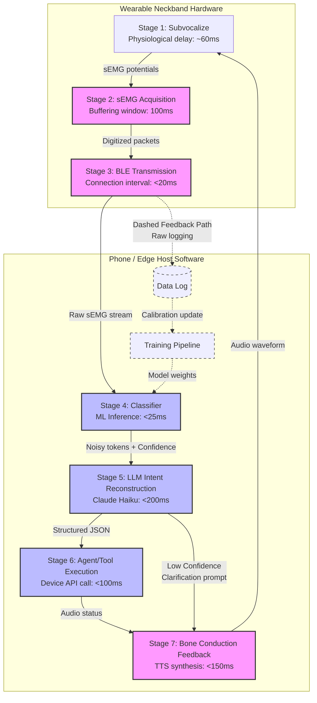

# The Architecture of a Practical Subvocal Interface

**Status:** Proposed  
**Version:** v0.1.0-alpha  
**Date:** June 2026  
**Audience:** Neurotech Builders, Agent Framework Developers, Accessibility Engineers  

---

## 1. Introduction: Hardware-First Myopia vs. Middleware Rails

A central tension defines the field of subvocal communication: the core technology has functioned in laboratory environments for over two decades. As early as 2004, researchers at NASA Ames demonstrated high-accuracy decoding of subauditory speech using surface electromyography (sEMG). Yet, in the years since, Silent Speech Interfaces (SSIs) have failed to transition from clinical or academic curiosities into practical consumer products.

Historically, the industry has suffered from **hardware-first myopia**. Builders focus heavily on designing proprietary neckbands, custom printed circuit boards (PCBs), and multi-channel electrode collars, treating the software as an afterthought. This vertical hardware approach hits three walls:
1. **The Vocabulary Ceiling:** Whole-word classifiers max out at 8 to 25 commands before classification accuracy plummets. You cannot navigate a modern mobile operating system if your jaw can only say "OPEN", "SEARCH", "CLICK", "SCROLL", "ENTER", and "CANCEL".
2. **The Repositioning Cliff:** sEMG is highly sensitive to spatial shift. Physical movement or re-donning the device shifts electrodes by a few millimeters, dropping classification accuracy by 15% to 25%.
3. **The Capital Barrier:** Manufacturing wearable electronics requires millions in capital, complex supply chains, and extensive regulatory clearance pathways (e.g., FDA Class II or CE/MDR review for speech assistance devices).

This document details the anatomical, engineering, and systems-level reasoning behind a platform pivot: **we decouple the physical sensor hardware from the cognitive agent by building a vendor-agnostic, open-source middleware layer.** Rather than treating the sEMG classifier as a direct "silent microphone," we reframe it as a **low-bandwidth intent channel** that feeds a noisy, compressed token stream to a context-aware Large Language Model (LLM) agent.

---

## 2. Form Factor Rationale: Why the Neckband?

Selecting a wearable form factor requires balancing signal quality with daily wearability and social acceptability. The comparison between an **anterior neckband** and **ear-adjacent/in-ear earbuds** is governed by clear anatomical and biophysical constraints.

```
                         [ Social Wearability ]
                                   │
              ┌────────────────────┴────────────────────┐
              ▼                                         ▼
      [ Post-Auricular / In-Ear ]               [ Anterior Neckband ]
      - High social acceptability               - Sleek sports collar styling
      - SCM motion noise (>100µV)               - High SNR speech musculature
      - Attenuated anterior potentials          - Stable mechanical contact
      - TMJ mechanical artifacts                - Dry textile compatible
      * RESULT: Anatomically Dead               * RESULT: Signal Viable
```

### Relevant Muscle Groups and Surface Accessibility
The human speech production mechanism relies on the coordinated activation of over one hundred muscles. These are divided into primary groups based on location and surface accessibility:
* **Suprahyoid Group (Submental):** Comprises the *mylohyoid*, *geniohyoid*, *stylohyoid*, and the *anterior belly of the digastric*. These form the floor of the mouth, running between the mandible and hyoid bone. They control tongue elevation, jaw depression, and initial consonant releases. They are highly superficial and accessible under the chin.
* **Infrahyoid Group (Strap Muscles):** Comprises the *sternohyoid*, *sternothyroid*, *thyrohyoid*, and *omohyoid*. Located on the anterior midline of the neck, they stabilize the larynx and modulate vocal tract length. They are directly accessible on the front of the neck flanking the trachea.
* **Laryngeal Extrinsic & Intrinsic Group:** Includes the *thyrohyoid* and *cricothyroid* (which controls vocal fold tension). They are accessible over the thyroid cartilage lamina on the flanks of the throat.

### Why Earbuds Fail
Earbud-based sEMG is highly socially acceptable but anatomically non-viable:
1. **SCM Motion Contamination:** Electrodes placed behind the ear (over the mastoid process) sit directly over the insertion of the **sternocleidomastoid (SCM)** muscle. The SCM is a massive neck muscle active during head rotation, tilting, walking, and breathing. Contractions generate high-amplitude potentials (>100 µV) that completely drown out microscopic subvocal speech potentials (<10–20 µV).
2. **Absence of Anterior Path:** The ear is separated from the anterior speech musculature by the mandible, the parotid gland, and the carotid sheath. Potentials are attenuated by the high impedance of these intervening tissues, making them unrecordable.
3. **Mechanical TMJ canal deflection:** In-ear electrodes pick up mechanical ear canal wall deflection caused by the movement of the temporomandibular joint (TMJ) during jaw motion. This is a gross mechanical movement artifact, not a neuromuscular sEMG signal.

### Why the Neckband Succeeds
A circumferential neckband collar aligns perfectly with the true distribution of speech-related neuromuscular signals:
* It makes direct bilateral contact with the infrahyoid strap muscles and the larynx flanks.
* An elastic collar design provides continuous, uniform mechanical pressure. This pressure maintains low-impedance contact with dry electrodes (such as graphene or PEDOT:PSS-coated textiles) without requiring sticky conductive gels that dry out and irritate the skin.
* It is easily styled as a standard consumer accessory (sports collar, neckband headphones) or concealed under a collared shirt.

---

## 3. Electrode Layout: The 5-Zone System

To capture the complex muscle activations of silent speech, the platform defines a standardized five-zone electrode layout. These zones are anchored by palpable anatomical landmarks, allowing repeatably aligned placement without rigid grid coordinates.

```
                    Zone 1: Suprahyoid / Digastric (Submental)
                 ┌──────────────────────────────────────────┐
                 │                [ Mandible ]              │
                 │   Zone 2: Mylohyoid (Submental Midline)  │
                 └──────────────────────────────────────────┘
                                      │
                                [ Hyoid Bone ]
                                      │
                 ┌──────────────────────────────────────────┐
                 │         Zone 3: Thyrohyoid Gap           │
                 │      [ Thyroid Cartilage / Adam's Apple ] │
                 │      Zone 4: Larynx Flanks (Lateral)     │
                 └──────────────────────────────────────────┘
                                      │
                 ┌──────────────────────────────────────────┐
                 │       Zone 5: Infrahyoid (Strap)         │
                 │             [ Trachea ]                  │
                 └──────────────────────────────────────────┘
```

### Zone Definitions:
1. **Zone 1 (Suprahyoid / Digastric):** Positioned submentally, 10–15 mm lateral to the midline on each side, superior to the hyoid bone. Captures jaw depression and floor-of-mouth elevation.
2. **Zone 2 (Mylohyoid):** Located on the midline of the submental area between the chin tip and the hyoid bone. Oriented in a transverse configuration to capture bilabial stop consonants (e.g. /p/, /b/).
3. **Zone 3 (Thyrohyoid Gap):** Located in the narrow 10–15 mm gap between the hyoid bone and the superior edge of the thyroid cartilage. Measures larynx elevation to distinguish voicing transitions (e.g., /d/ vs /t/).
4. **Zone 4 (Larynx Flanks):** Positioned bilaterally over the thyroid cartilage lamina. Targets cricothyroid activity and voice onset dynamics.
5. **Zone 5 (Infrahyoid Strap):** Positioned on the anterior neck below the hyoid bone, flanking the trachea. Targets superficial sternohyoid and omohyoid muscles, providing high SNR activations linked to speech phrasing.

### The Optional Chin Extension
Because Zones 1 and 2 lie above the hyoid bone, a standard straight neckband collar cannot contact them. Capturing them requires a curved submental bridge (chin extension) rising 40–60 mm from the collar. The chin extension is **explicitly optional** and is omitted when specific conditions are met:
* **Condition A (Closed-Vocabulary Targets):** For simple closed vocabularies (10–25 commands), neck-only channels (Zones 3–5) provide sufficient discriminative features. If a within-session classifier achieves $\ge 95\%$ accuracy on Zones 3–5, the mechanical complexity of the chin bridge is omitted.
* **Condition B (Social UX Constraints):** In mainstream consumer settings, a visible chin bridge is socially stigmatizing (projecting a medical look) and restricts natural head movement. For consumer adoption, it is omitted in favor of collar-only contacts.
* **Condition C (Biophysical Noise):** Variations in submental fat and jaw profiles can cause electrodes on a rising bridge to slide during head rotation, creating motion artifacts that exceed their classification gain.
* **Condition D (Manufacturing Cost):** If the adjustable mechanical articulation increases the Bill of Materials (BOM) beyond the marginal utility of open-vocabulary phonetic accuracy, it is omitted.

### Electrode Count and Routing Optimization
To adapt to low-power, edge microcontroller configurations, routing is optimized into three reference layouts:

| Configuration | Channels | Contacts | Target Application |
|---|---|---|---|
| **Base Collar (Zones 3–5)** | 8 Differential | 16 Contacts | Closed-Vocabulary Consumer Navigation (Media / Assistant) |
| **With Chin Extension (Zones 1–5)** | 11 Differential | 22 Contacts | Open-Vocabulary Phoneme Decoding |
| **Optimized Common-Reference Array** | 10 Single-Ended | 11 Contacts | Low-BOM / Low-Power Consumer Release |

By adopting a **common-reference routing scheme** (placing active contacts around the neck referenced to a single ground contact over the C7 vertebra), we capture the entire 5-zone space using only 11 contacts. This reduces Analog-to-Digital Converter (ADC) requirements and hardware space while preventing signal shunting.

---

## 4. Intent Reconstruction: Not a Silent Microphone

The core failure of early silent speech interfaces was a conceptual one: they were modeled as **silent microphones** whose sEMG classifiers must act as direct speech-to-text transcribers. This framing evaluates the system using Word Error Rate (WER). To be viable, a silent microphone must compete with acoustic ASR systems, requiring a $\le 5\%$ WER.

This bar is biophysically impossible for dry-electrode consumer neckbands due to the absence of vocal fold resonance and expelled airflow. While SOTA clinical systems using wet gel adhesives on facial arrays achieve an 8.9% WER under laboratory conditions, a practical dry-electrode neckband yields a raw classifier WER of **15% to 25%** at best. Under a silent mic framing, a 15–25% WER is unusable.

We reframe the subvocal interface as a **low-bandwidth intent channel**. The sEMG classifier's output is not a final text transcript, but rather a stream of noisy, compressed phonetic tokens. The receiver is a Large Language Model (LLM) that reconstructs the user's full, high-fidelity intent by combining this noisy token stream with the active consumer device context.

```
[ sEMG Neckband ] ──> ( Noisy Tokens: "nxt trak" ) ──────┐
                                                         ├─> [ LLM Intent Decoder ] ──> { Action: SKIP_TRACK }
[ Active Context ] ──> ( App: Spotify; Status: playing ) ┘
```

The LLM does not function as a post-hoc spell-checker; it is the primary decoder, resolving ambiguities using five layers of context:
1. **Application State:** The active foreground app on the user's phone (e.g., if a music player is active, the LLM prioritizes media navigation over sending a text message).
2. **Environment Metadata:** The user's GPS coordinates, local weather, and transit status.
3. **Notification History:** The sequence of recent notifications (e.g., if a text message asking "Are you running late?" has just arrived, the LLM knows the next subvocal input is highly likely to be a template response like "yes", "no", or "running late").
4. **User Profile:** The user's personal contact book, favorite music playlists, and calendar database (constraining search dictionaries for names and titles).
5. **Phonetic Proximity Map:** The phonetic confusion matrix of the classifier (e.g., if the classifier outputs `"tacks"`, the LLM uses phonetic distance to resolve it to `"text"` because `"text"` is a valid action in the active messaging state, whereas `"tacks"` is not).

This reframing shifts the target performance metric from a raw Word Error Rate to the **Intent Execution Success Rate (target $\ge 95\%$)**. A system with a raw classifier error rate of 20% can consistently achieve a $\ge 95\%$ execution success rate by utilizing these contextual constraints and prompting the user for confirmation (via bone conduction) if the classifier's output confidence falls below a set threshold.

---

## 5. The Signal Path

The flow of information from the user's motor cortex to the final system action is executed in a seven-stage signal pipeline:



### The 7-Stage Pipeline Specifications:
1. **Stage 1: Subvocalize (60 ms):** The user internally articulates a command. Efferent signals propagate to the speech muscles, generating sEMG potentials on the skin surface.
2. **Stage 2: sEMG acquisition (100 ms):** Bipolar dry contacts capture differential voltages. Signals are amplified, filtered (20–450 Hz bandpass + 60 Hz notch), and digitized using a 16-bit ADC. The sliding window buffers 100 ms of data.
3. **Stage 3: BLE transmission (<20 ms):** An ESP32 microcontroller packetizes the data and transmits it via BLE GATT notification to a paired edge host, targeting a 15 ms connection interval.
4. **Stage 4: Classifier (<25 ms):** The phone-side host runs a classifier (1D CNN or Random Forest) on the raw sEMG stream, outputting a softmax probability distribution over vocabulary classes.
5. **Stage 5: LLM intent reconstruction (<200 ms):** Claude 3.5 Haiku receives the raw tokens, confidence scores, and active device context, outputting a structured JSON intent schema. If the classifier confidence falls below 0.75, the LLM triggers a confirmation request.
6. **Stage 6: Agent / tool execution (<100 ms):** The structured intent is dispatched to a local mobile app tool or consumer API (e.g., music control, messaging).
7. **Stage 7: Bone conduction audio feedback (<150 ms):** Native system TTS synthesizes the response (e.g., "Skipping track") and plays it via bone conduction transducers integrated into the neckband wings.

### Latency Budget:

| Stage | Target Latency | Status / Source |
|---|---|---|
| 1. Subvocalize → sEMG surface | ~60 ms | Physiological, fixed |
| 2. sEMG acquisition (window) | 100 ms | Hardware buffering |
| 3. BLE transmission | <20 ms | ESP32 BLE GATT connection |
| 4. Classifier inference | <25 ms | Phone-side ML (verified locally on CPU) |
| 5. LLM intent reconstruction | <200 ms | Claude Haiku API / local model |
| 6. Agent tool execution | <100 ms | Device API call |
| 7. TTS + bone conduction | <150 ms | On-device audio buffer |
| **Total (p50 target)** | **655 ms** | **Target <1 second** |

An end-to-end latency of **655 ms** represents a significant speed advantage over standard consumer voice assistants, which typically require 1.0 to 1.5 seconds from trigger word completion to response initiation.

---

## 6. What this Architecture Cannot Do (Yet)

A practical systems design must be transparent about its physiological and engineering limits:
1. **Vocabulary Scaling Ceiling:** The intent-reconstruction model does not enable unconstrained, open-vocabulary continuous speech. While it elevates the practical vocabulary ceiling of a dry neckband from ~25 words to **200–500 commands** by using contextual disambiguation, it cannot decode a 50,000-word open vocabulary.
2. **Inter-Session Electrode Shift:** Physical landmark-based mechanical alignment reduces, but does not eliminate, repositioning errors. To maintain a target accuracy of $\ge 85\%$, the system still requires a **<10 minute calibration drill** when the user first dons the device.
3. **Purely Covert Speech:** The system cannot decode purely mental rehearsal (where the user thinks the word without any muscle innervation). The system requires **subvocally mouthed speech** (involving micro-contractions and subtle articulatory movements).
4. **Cross-User Generalization:** Due to anatomical variations, the classifier is not zero-shot. It requires user-specific training data to construct the initial classifier weights.

---

## 7. The One Ask: Beta Program Call to Action

The viability of the intent-reconstruction layer has been proven in simulation. The next step is validating the architecture under real-world operational constraints:

> [!IMPORTANT]
> **Beta Opportunities:** If you are a mobile developer or early adopter and want to participate in a simulated pilot of the intent-reconstruction software layer (which utilizes simulated noisy inputs and requires no physical hardware), please get in touch at `beta@subvocal.dev`.
