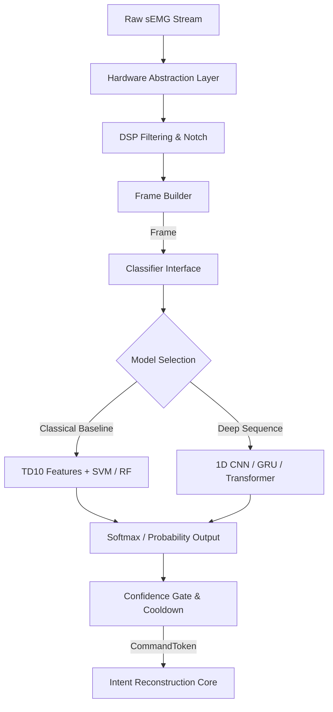

# Classifier Infrastructure & Reference Models

This document specifies the architecture, data flows, and performance characteristics of the sEMG classifier subsystem. The classifier layer serves as the physiological interface of the subvocal middleware, transforming multi-channel signal frames into discrete command tokens with associated confidences.



---

## 1. The Classifier Interface

All classification components implement the unified `Classifier` abstract base class defined in `sdk/core/interfaces.py`:

```python
class Classifier(ABC):
    """Abstract interface for classifying physiological raw signals into command tokens."""

    @abstractmethod
    def predict(self, frame: Union[Frame, Any]) -> Optional[CommandToken]:
        """Classifies a Frame of raw signals into a CommandToken (applies gating/cooldown)."""
        pass

    @abstractmethod
    def predict_raw(self, frame: Union[Frame, Any]) -> Tuple[str, float, List[float]]:
        """Predicts the probability distribution for a Frame of raw signals.

        Returns:
            (predicted_class_label, max_probability, all_probabilities_list)
        """
        pass

    @property
    @abstractmethod
    def labels(self) -> List[str]:
        """Returns the list of output labels/classes supported by the classifier."""
        pass
```

### Data Translation
During real-time inference, the `InferenceEngine` dynamically converts incoming structured Pydantic `Frame` objects into NumPy multi-channel segments using `Frame.to_numpy()` before ingestion, ensuring seamless typing compatibility.

---

## 2. Reference Model Architectures

The middleware provides five reference architectures to accommodate diverse hardware environments, ranging from zero-dependency embedded microcontrollers to dedicated neural accelerators.

### A. Classical Feature-Based Baselines
Classical pipelines extract statistical temporal features over sliding windows and pool them into fixed-length vectors.
1. **TD10 Feature Pipeline**: Decomposes signals into low-frequency articulation movements (double moving average) and muscular energy. For a 4-channel system, stacking ±10 context frames yields an 840-dimensional feature vector.
2. **Random Forest (`rf`)**: An ensemble baseline of decision trees mapping high-dimensional TD10 features to target gestures.
3. **Support Vector Machine (`svm`)**: An SVM baseline utilizing a Radial Basis Function (RBF) kernel and Platt scaling for probability calibration, optimized for high separability on small calibration sets.

### B. Deep Sequence Architectures
Deep learning models bypass manual feature engineering, operating directly on z-score standardized raw time-series arrays of shape `(Batch, Channels, Time)`.
1. **1D CNN (`cnn`)**: Applies three stages of temporal 1D convolutions, batch normalization, and max pooling, followed by adaptive average pooling to feed a classification head.
2. **GRU (`gru`)**: A bidirectional Gated Recurrent Unit network that models bidirectional temporal dependencies, using global mean pooling to aggregate hidden states.
3. **Small Transformer (`transformer`)**: A sequence-to-sequence model that projects raw multi-channel steps into a latent space, adds a learnable positional embedding, and processes the sequence with multi-head self-attention.

---

## 3. Reproducible Runs & Training Configs

Training parameters are governed by the `TrainingConfig` Pydantic model (`sdk/emg_core/ml/config_schema.py`) to ensure reproducibility. Configs are stored alongside model weights to enable full lineage tracking:

```json
{
  "model_type": "cnn",
  "seed": 42,
  "test_size": 0.2,
  "epochs": 40,
  "batch_size": 16,
  "lr": 0.001,
  "weight_decay": 0.0001,
  "hidden_size": 64,
  "num_layers": 2
}
```

---

## 4. Per-User Calibration & Fine-Tuning

Silent speech gestures vary highly across individuals due to anatomical differences and sensor placement. The middleware implements a transfer learning calibration routine (`calibrate_model`):

1. **Weight Initialization**: Loads pre-trained model weights trained on public/synthetic multi-subject datasets.
2. **Architecture Adaptation**: Discards the original output layer and attaches a new classification head matching the target user's command labels.
3. **Layer Freezing**: Freezes base feature-extraction layers to prevent representation degradation.
4. **Fine-Tuning**: Trains the head parameters on the user's local calibration dataset using a reduced learning rate ($10^{-4}$) to adapt quickly (15 epochs) without overfitting.

---

## 5. Model Export & int8 Quantization

For low-power mobile or wearable integration, models can be compiled and optimized.

### PyTorch → ONNX
Models are exported to ONNX format with dynamic batch sizes:
```bash
python3 -m emg_core.ml.export --user_id <user> --model_type cnn --format onnx
```

### Dynamic int8 Quantization
Using PyTorch's dynamic quantization, linear and recurrent weights are quantized from float32 to int8:
$$\mathbf{W}_{\text{int8}} = \text{round}\left(\frac{\mathbf{W}_{\text{float32}}}{\text{scale}}\right) + \text{zero\_point}$$

### Accuracy Regression Check
To safeguard against precision loss, the quantization pipeline runs a verification check on user validation data. If the drop in accuracy exceeds the configured threshold, the quantized model is rejected:
$$\text{Accuracy}_{\text{float32}} - \text{Accuracy}_{\text{int8}} \le 0.05 \quad (5\%)$$

---

## 6. Offline Benchmarking Profile

An offline benchmark harness (`sdk/emg_core/ml/benchmark.py`) measures system footprint and profiles execution cost:

* **Latency (ms)**: Measures mean, median, p95, and standard deviation over 200 inference loops on CPU.
* **Memory Footprint**: Logs disk size (KB) of serialized weights and total active parameter count.
* **FLOPs Estimation**: Computes the exact floating point operations for forward passes:
  * **1D CNN**: $\sum 2 \cdot k \cdot C_{\text{in}} \cdot C_{\text{out}} \cdot T_{\text{out}} + \sum 2 \cdot I \cdot O$
  * **GRU**: $4 \cdot L \cdot T \cdot 3 \cdot 2 \cdot (H(H + C) + H)$
  * **Transformer**: $2 \cdot C \cdot H \cdot T + L \cdot (2 \cdot H^2 \cdot (3 + 1) \cdot T + 2 \cdot H \cdot T^2 + 2 \cdot H \cdot 2H \cdot T \cdot 2)$
* **Energy Consumption**: Estimated at a standard edge accelerator coefficient:
  $$\text{Energy } (\mu\text{J}) = \text{FLOPs} \cdot 100\text{ pJ} \cdot 10^{-6}$$

### Reference Benchmark Targets (Intel/ARM CPU Core)

| Model Type | Params | Disk Size (KB) | Latency (Mean) | FLOPs (Est) | Energy (Est) |
| :--- | :--- | :--- | :--- | :--- | :--- |
| **Random Forest** | N/A | 340 KB | ~1.2 ms | 750,000 | 0.075 $\mu$J |
| **SVM** | N/A | 180 KB | ~0.8 ms | 750,000 | 0.075 $\mu$J |
| **1D CNN** | ~72K | 290 KB | ~2.5 ms | 3,780,000 | 0.378 $\mu$J |
| **GRU (2-Layer)** | ~132K | 530 KB | ~8.4 ms | 30,180,000 | 3.018 $\mu$J |
| **Transformer** | ~240K | 980 KB | ~14.1 ms | 31,180,000 | 3.118 $\mu$J |
| **CNN (Quantized)**| ~72K | 90 KB | ~1.8 ms | 2,646,000 | 0.264 $\mu$J |
