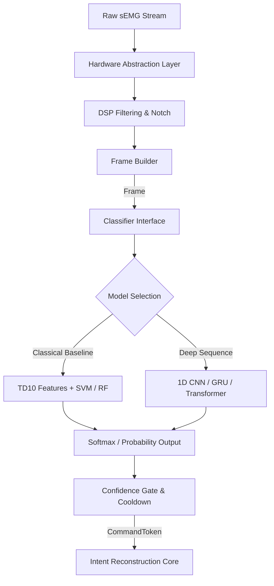

# Classifier Infrastructure & Reference Models

This document specifies the architecture, data flows, and performance characteristics of the sEMG classifier subsystem. The classifier layer serves as the physiological interface of the subvocal middleware, transforming multi-channel signal frames into discrete command tokens with associated confidences.


```mermaid
graph TD
    A[Raw sEMG Stream] --> B[Hardware Abstraction Layer]
    B --> C[DSP Filtering & Notch]
    C --> D[Frame Builder]
    D -->|Frame| E[Classifier Interface]
    E --> F{Model Selection}
    F -->|Classical Baseline| G[TD10 Features + SVM / RF]
    F -->|Deep Sequence| H[1D CNN / GRU / Transformer]
    G --> I[Softmax / Probability Output]
    H --> I
    I --> J[Confidence Gate & Cooldown]
    J -->|CommandToken| K[Intent Reconstruction Core]
```

---

## 1. The Classifier Interface

All classification components implement the unified `Classifier` abstract base class defined in `sdk/core/interfaces.py`:

```python
class Classifier(ABC):
    """Abstract interface for classifying physiological raw signals into command tokens."""

    @abstractmethod
    def predict(self, frame: Union[Frame, Any]) -> Optional[CommandToken]:
        """Classifies a Frame of raw signals into a CommandToken (applies gating/cooldown)."""
        pass

    @abstractmethod
    def predict_raw(self, frame: Union[Frame, Any]) -> Tuple[str, float, List[float]]:
        """Predicts the probability distribution for a Frame of raw signals.

        Returns:
            (predicted_class_label, max_probability, all_probabilities_list)
        """
        pass

    @property
    @abstractmethod
    def labels(self) -> List[str]:
        """Returns the list of output labels/classes supported by the classifier."""
        pass
```

### Data Translation
During real-time inference, the `InferenceEngine` dynamically converts incoming structured Pydantic `Frame` objects into NumPy multi-channel segments using `Frame.to_numpy()` before ingestion, ensuring seamless typing compatibility.

---

## 2. Reference Model Architectures

The middleware provides reference architectures spanning zero-dependency embedded
microcontrollers to foundation-model research — all gated by `subvocal[ml]`
where `torch`/`sklearn` is required (see [Configuration](configuration.md)).

### A. Classical Feature-Based Baselines
Classical pipelines extract statistical temporal features over sliding windows and pool them into fixed-length vectors.
1. **TD10 Feature Pipeline**: Decomposes signals into low-frequency articulation movements (double moving average) and muscular energy. For a 4-channel system, stacking ±10 context frames yields an 840-dimensional feature vector.
2. **Random Forest (`rf`)**: An ensemble baseline of decision trees mapping high-dimensional TD10 features to target gestures.
3. **Support Vector Machine (`svm`)**: An SVM baseline utilizing a Radial Basis Function (RBF) kernel and Platt scaling for probability calibration, optimized for high separability on small calibration sets.

### B. Handcrafted 112 (`subvocal.emg_core.dsp.handcrafted`, Mohapatra et al. ACL 2025; Jou et al. 2006; Gaddy & Klein EMNLP 2020)
Per-channel 28 features × 4 channels = 112-D spectral-temporal vector, no `torch`
required (NumPy + optional SciPy Welch):
* **Temporal 11**: MAV, RMS, VAR, WL, ZC, SSC, WAMP, IEMG, SSI, DASDV, LOGVAR
* **Stats 7**: mean, std, min, max, peak-to-peak, skewness, kurtosis
* **Spectral 10**: MNF, MDF, centroid, bandpower, bandpower-low/high, peak-freq, entropy, spread, rolloff (85 %)

```python
from subvocal.emg_core.dsp.handcrafted import extract_handcrafted_features
feats = extract_handcrafted_features(segment, fs=250)  # (T,C) -> (112,)
seq   = extract_handcrafted_timevarying(segment, fs=250, window_ms=50, step_ms=20)  # (num_windows,112)
```
For `C≠4`, the output is padded/truncated to 112 to satisfy `EMGAdaptor(input_dim=112)`.

### C. SPD-GRU CTC (`subvocal.emg_core.ml.spd_gru`, Gowda & Miller ACL 2025; Findings of ACL 2026; J. Neural Eng. 2024)
Riemannian sEMG → phoneme decoder. SPD covariance `(T,C) → (C,C)` via `eps*I`,
affine-invariant `logm` via batched `eigh` → upper-tri flatten to `K=C(C+1)/2`
(e.g. 10 for `C=4`, torch-grad enabled) → `Linear(K→hidden)` → 3-layer GRU → `Linear(hidden→V)`:

```python
from subvocal.emg_core.ml.spd_gru import SPDGRU, ctc_loss, greedy_decode
model = SPDGRU(num_channels=4, hidden_size=64, num_layers=3, num_phonemes=40)  # blank=0
logits = model(spd_seq)  # (B,T,C,C) or (T,C,C) -> (B,T,40)
loss = ctc_loss(log_probs, targets, input_lengths, target_lengths)
pred = greedy_decode(logits, blank_id=0)  # collapse + blank removal
```

Vocabulary: 40 phonemes (CMU-like subset + CTC blank at 0, Gowda 2025 Table 1).
Training helpers `train_step(model, optimizer, logits, ...)` and `train_spd_gru(model, optimizer, spd_seq, ...)` implement the AdamW CTC loop.

### D. SpeechNet (`subvocal.emg_core.ml.speechnet`, Spacone et al. 2026, SilentWear / ETH Zurich)
Tiny depthwise-separable CNN for 8 commands + rest, tailored for GAP9 MCU
(~15 k params, 63.9 µJ / 6.4 ms on GAP9):

```
Block1: DW Conv1d C→C k7 + PW C→32 + BN/ReLU + MaxPool2
Block2: DW 32→32 k5 + PW 32→64 + BN/ReLU + MaxPool2
Block3: DW 64→64 k3 + PW 64→96 + BN/ReLU + MaxPool2
→ AdaptiveAvgPool(8) → Linear(96*8 → num_classes)
```

```python
from subvocal.emg_core.ml.speechnet import SpeechNet, finetune_inter_session
net = SpeechNet(num_channels=4, num_classes=8, segment_length=150, dropout=0.2)
net.count_parameters()   # ~15k (C=14) to ~11k (C=4)
net.estimate_energy()    # 63.9 µJ scaled by C/14
finetune_inter_session(net, train_loader, val_loader, epochs=5, lr=5e-4, freeze_backbone=True)
```

Inter-session fine-tuning freezes the depthwise backbone and retrains only the
linear head (<10 min calibration, SilentWear protocol).

### E. TinyMyo Foundation (`subvocal.emg_core.foundation.tinymyo`, `arXiv:2512.15729`)
3.6 M-parameter Transformer encoder: channel-independent patching (`patch_size=10`
→ shared `Linear(patch→128)`), 50 % SimMIM random masking via learned `mask_token`,
8 bidirectional Transformer blocks with pre-norm + RoPE + GELU FFN (`mlp_ratio=12.0`),
lightweight `Linear(128→10)` reconstruction decoder:

```python
from subvocal.emg_core.foundation import TinyMyoEncoder, TinyMyoFoundation
enc = TinyMyoEncoder(num_channels=4, patch_size=10, embed_dim=128, depth=8, num_heads=4, mask_ratio=0.5)
fm  = TinyMyoFoundation(encoder=enc, num_classes=8, regression_dim=1, vocab_size=40)
fm.pretrain_step(x, optimizer)                # MSE on masked patches
fm.finetune_step(x, y, task="classification") # CE over pooled embeddings
```

Heads: `classifier` (pooled mean → 8), `regressor`, `speech_head` (per-patch CTC `40`).
Use `count_parameters()` / `estimate_flops(seq_len=150)` for profiling; missing `torch` raises `MissingDependencyError` with `subvocal[ml]` hint.

### F. AEMG Tokenizer (`subvocal.emg_core.foundation.aemg_tokenizer`, Huang et al. CVPR 2026)
NCT sliding-window segmentation into contraction primitives (≈30–100 ms, `window_size=32`/`stride=16`) + vector quantization (`codebook K=512/D=64`, `torch.cdist` when `N>64` else NumPy, overlap-add reconstruction):

```python
from subvocal.emg_core.foundation import EMGTokenizer, AEMGFramework
tok = EMGTokenizer(codebook_size=512, token_dim=64, window_size=32, stride=16)
ids = tok.encode(signal)   # (T,C) -> (num_tokens,)
rec = tok.decode(ids)      # overlap-add via codebook
fw  = AEMGFramework(tokenizer=tok, mask_ratio=0.15)
fw.pretrain_step(ids)      # 2-layer Transformer masked LM or heuristic loss
```

Self-supervised masked modeling over token sentences learns a universal vocabulary
shared across subjects/sessions (random masking + collective token prediction).

### G. Deep Sequence Architectures (baseline)
Deep learning models bypass manual feature engineering, operating directly on z-score standardized raw time-series arrays of shape `(Batch, Channels, Time)`.
1. **1D CNN (`cnn`)**: Applies three stages of temporal 1D convolutions, batch normalization, and max pooling, followed by adaptive average pooling to feed a classification head.
2. **GRU (`gru`)**: A bidirectional Gated Recurrent Unit network that models bidirectional temporal dependencies, using global mean pooling to aggregate hidden states.
3. **Small Transformer (`transformer`)**: A sequence-to-sequence model that projects raw multi-channel steps into a latent space, adds a learnable positional embedding, and processes the sequence with multi-head self-attention.

#### DSP alternatives to TD10 — summary

| Front-end | Module | Dims | Torch-free | Paper |
|---|---|---|---|---|
| TD10 | `emg_core.dsp.features` | 840 (`C=4, ±10 ctx`) | Yes | Baseline |
| Handcrafted 112 | `dsp.handcrafted` | 112 (`28×4`) | Yes | Mohapatra ACL 2025 |
| SPD Riemannian | `dsp.spd` | `K=C(C+1)/2` (10 @ `C=4`) | Yes | Gowda & Miller ACL 2026 |
| STFT spectral | `foundation.spectre.stft_kmeans_pseudolabels` | `n_clusters=64` | With fallback | SPECTRE `arXiv:2512.22481` |

---

## 3. Reproducible Runs & Training Configs

Training parameters are governed by the `TrainingConfig` Pydantic model (`src/subvocal/emg_core/ml/config_schema.py`) to ensure reproducibility. Configs are stored alongside model weights to enable full lineage tracking:

```json
{
  "model_type": "cnn",
  "seed": 42,
  "test_size": 0.2,
  "epochs": 40,
  "batch_size": 16,
  "lr": 0.001,
  "weight_decay": 0.0001,
  "hidden_size": 64,
  "num_layers": 2
}
```

Training helpers per architecture (all require `torch` → `pip install "subvocal[ml]"`):

* **SPD-GRU**: `train_step` / `train_spd_gru` / `ctc_loss` / `greedy_decode` in `emg_core.ml.spd_gru` (see §2C).
* **SpeechNet**: `train_speechnet` (from scratch, `TensorDataset` + `AdamW`+`CrossEntropy`) and `finetune_inter_session` / `finetune_speechnet` (freeze backbone, 5 epochs, `lr=5e-4`) in `emg_core.ml.speechnet` (see §2D).
* **TinyMyo**: `TinyMyoFoundation.pretrain_step` / `finetune_step` and functional `pretrain_step` / `finetune_step` in `emg_core.foundation.tinymyo` (see §2E).
* **AEMG**: `EMGTokenizer.encode`/`decode` + `AEMGFramework.pretrain_step` / `encode_and_mask` in `emg_core.foundation.aemg_tokenizer` (see §2F).
* **SPECTRE**: `stft_kmeans_pseudolabels` + `SPECTREEncoder.ssl_loss` / `forward` with `mask` (see [Configuration](configuration.md)).

`TrainingConfig` is shared for `rf`/`svm`/`cnn`/`gru`/`transformer`; foundation/adaptation modules use direct constructor params as documented above and are not part of `SubvocalConfig`.

---

## 4. Per-User Calibration & Fine-Tuning

Silent speech gestures vary highly across individuals due to anatomical differences and sensor placement. The middleware implements a transfer learning calibration routine (`calibrate_model`):

1. **Weight Initialization**: Loads pre-trained model weights trained on public/synthetic multi-subject datasets.
2. **Architecture Adaptation**: Discards the original output layer and attaches a new classification head matching the target user's command labels.
3. **Layer Freezing**: Freezes base feature-extraction layers to prevent representation degradation.
4. **Fine-Tuning**: Trains the head parameters on the user's local calibration dataset using a reduced learning rate ($10^{-4}$) to adapt quickly (15 epochs) without overfitting.

Foundation/adaptation calibration is handled by module-specific helpers rather than `calibrate_model`:

* **SpeechNet inter-session**: `finetune_inter_session(..., freeze_backbone=True, epochs=5, lr=5e-4)` — only the head (`96*8→8`) updates, <10 min data (≈50–150 utterances) per SilentWear (Spacone et al. 2026).
* **SAL/LBN**: `adapt_sal_lbn(backbone, sal_lbn, calib_loader, epochs=5, lr=1e-3)` — supervised affine correction, backbone frozen (Pereira et al. `arXiv:2409.08058`).
* **CPEP**: `CPEPFramework.zero_shot_predict(query_emg, gallery_pose_embs, gallery_labels, k=10)` — no target data, or few-shot kNN after `pose_emg_contrastive_loss` alignment (Cui et al. `arXiv:2509.04699`).
* **Variance Transfer**: `transfer_to_target(posterior, calib_data, calib_labels, w_s=1.0)` — closed-form Bayesian update of precision with 1 trial (Yoneda et al. `arXiv:2505.15381`).
* **TinyMyo**: `TinyMyoFoundation.finetune_step(..., task="classification")` — fine-tune pooled head on calibration split; pre-training uses `pretrain_step` masked MSE (`arXiv:2512.15729`).

---

## 5. Model Export & int8 Quantization

For low-power mobile or wearable integration, models can be compiled and optimized.

### PyTorch → ONNX
Models are exported to ONNX format with dynamic batch sizes:
```bash
python3 -m emg_core.ml.export --user_id <user> --model_type cnn --format onnx
python3 -m emg_core.ml.export --user_id <user> --model_type speechnet --format onnx  # SpeechNet GAP9
```

### Dynamic int8 Quantization
Using PyTorch's dynamic quantization, linear and recurrent weights are quantized from float32 to int8:
$$\mathbf{W}_{\text{int8}} = \text{round}\left(\frac{\mathbf{W}_{\text{float32}}}{\text{scale}}\right) + \text{zero\_point}$$

For **SpeechNet on GAP9** (Spacone et al. 2026) the reference flow is: train → `finetune_inter_session` calibration → export ONNX with `dynamic_axes` (batch) → GreenWaves GAP9 NNTool quantization to `int8` (per-layer scale/zero-point, autotiler memory). Paper reports 63.9 µJ / 6.4 ms at 10 mW for the 15k int8 model; `SpeechNet.estimate_energy()` / `estimate_latency()` / `estimate_flops()` mirror these budgets (scaled by `num_channels/14`), and `count_parameters()` validates the ~15k footprint before flashing. No new code path is needed — the same `emg_core.ml.export` jail + `weights_only=True` guards apply.

### Accuracy Regression Check
To safeguard against precision loss, the quantization pipeline runs a verification check on user validation data. If the drop in accuracy exceeds the configured threshold, the quantized model is rejected:
$$\text{Accuracy}_{\text{float32}} - \text{Accuracy}_{\text{int8}} \le 0.05 \quad (5\%)$$

### Secure Model I/O (`subvocal.emg_core.ml.model_io`)

All per-user weights are jailed to `MODELS_DIR`:

- **Path sanitization**: `user_id` and `model_type` are sanitized via `re.sub(r"[^A-Za-z0-9_-]", "_", value)` and the resolved path is verified with `Path.resolve().is_relative_to(MODELS_DIR.resolve())` (fallback to `relative_to` on Python <3.9); traversal attempts raise `ValueError`.
- **Safe deserialization**: PyTorch checkpoints load with `torch.load(..., weights_only=True)` so only tensors and explicitly allow-listed NumPy types (`np.ndarray`, `np.dtype`, scalars via `torch.serialization.add_safe_globals`) are unpickled. Legacy checkpoints fall back to `weights_only=False` only after the path jail confirms a trusted location. `joblib.load` is used only for `rf`/`svm` types on the same jailed path.
- **Export guards**: `emg_core.ml.export` and training utilities apply the same `is_relative_to` jail when resolving export paths.

---

## 6. Offline Benchmarking Profile

An offline benchmark harness (`sdk/emg_core/ml/benchmark.py`) measures system footprint and profiles execution cost:

* **Latency (ms)**: Measures mean, median, p95, and standard deviation over 200 inference loops on CPU.
* **Memory Footprint**: Logs disk size (KB) of serialized weights and total active parameter count.
* **FLOPs Estimation**: Computes the exact floating point operations for forward passes:
  * **1D CNN**: $\sum 2 \cdot k \cdot C_{\text{in}} \cdot C_{\text{out}} \cdot T_{\text{out}} + \sum 2 \cdot I \cdot O$
  * **GRU**: $4 \cdot L \cdot T \cdot 3 \cdot 2 \cdot (H(H + C) + H)$
  * **Transformer**: $2 \cdot C \cdot H \cdot T + L \cdot (2 \cdot H^2 \cdot (3 + 1) \cdot T + 2 \cdot H \cdot T^2 + 2 \cdot H \cdot 2H \cdot T \cdot 2)$
* **Energy Consumption**: Estimated at a standard edge accelerator coefficient:
  $$\text{Energy } (\mu\text{J}) = \text{FLOPs} \cdot 100\text{ pJ} \cdot 10^{-6}$$

### Reference Benchmark Targets (Intel/ARM CPU Core)

| Model Type | Params | Disk Size (KB) | Latency (Mean) | FLOPs (Est) | Energy (Est) |
| :--- | :--- | :--- | :--- | :--- | :--- |
| **Random Forest** | N/A | 340 KB | ~1.2 ms | 750,000 | 0.075 $\mu$J |
| **SVM** | N/A | 180 KB | ~0.8 ms | 750,000 | 0.075 $\mu$J |
| **1D CNN** | ~72K | 290 KB | ~2.5 ms | 3,780,000 | 0.378 $\mu$J |
| **GRU (2-Layer)** | ~132K | 530 KB | ~8.4 ms | 30,180,000 | 3.018 $\mu$J |
| **Transformer** | ~240K | 980 KB | ~14.1 ms | 31,180,000 | 3.118 $\mu$J |
| **CNN (Quantized)**| ~72K | 90 KB | ~1.8 ms | 2,646,000 | 0.264 $\mu$J |
